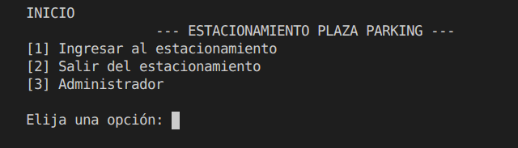
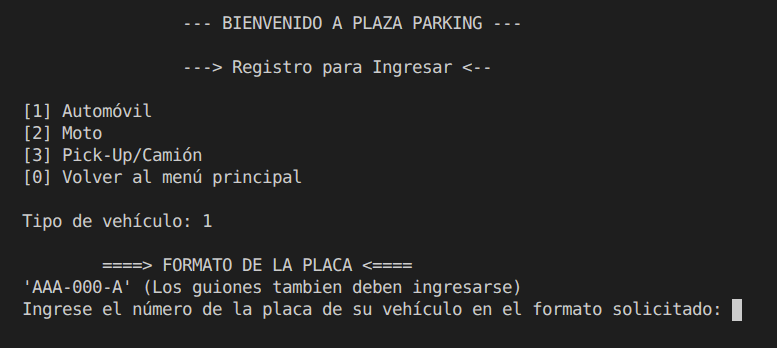
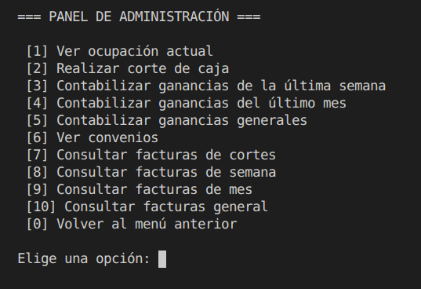

# Sistema de Control de Estacionamiento

Sistema de gestión de estacionamiento desarrollado en **C++** mediante *Programación Orientada a Objetos (POO)*, persistencia de datos en archivos binarios y administración de espacios de estacionamiento.

El sistema permite registrar entradas y salidas de vehículos, generar tickets, administrar convenios empresariales, controlar la ocupación del estacionamiento y generar reportes financieros mediante cortes de caja y facturación.

La aplicación gestiona un estacionamiento con capacidad para múltiples tipos de vehículos, realizando la asignación automática de espacios disponibles, el cálculo de tiempos de permanencia y la aplicación de distintos esquemas de cobro, incluyendo modalidades por hora, por día y pensiones mensuales.

También se incorporan mecanismos de persistencia para conservar información operativa y administrativa entre ejecuciones, permitiendo almacenar tickets, facturas, cortes de caja, estados de ocupación y datos asociados a convenios empresariales. Esta información se organiza automáticamente a través de una estructura de carpetas generada por el sistema durante su configuración inicial.

El proyecto integra conceptos de programación orientada a objetos, gestión de archivos, automatización administrativa y desarrollo multiplataforma, ofreciendo una solución capaz de simular la operación de un sistema real de control y administración de estacionamientos.

<p align="center">
    <br>
    <em>Figura 1. Menú Principal del Sistema.</em><br>
</p>

## Características

* Registro de entrada de vehículos.
* Registro de salida mediante folio de ticket.
* Asignación automática de espacios.
* Control de capacidad por tipo de vehículo.
* Generación de tickets de entrada.
* Generación de tickets de salida.
* Aplicación de convenios y descuentos empresariales.
* Generación de cortes de caja.
* Generación de reportes semanales.
* Generación de reportes mensuales.
* Generación de reportes generales.
* Persistencia de información mediante archivos binarios.
* Compatibilidad con Linux y Windows.

<p align="center">
    <br>
    <em>Figura 2. Registro de ingreso de vehículos al estacionamiento.</em><br>
</p>

## Tipos de Vehículos

```tabla
|      Tipo        | Capacidad |
|------------------|-----------|
|   Automóviles    |    600    |
|   Motocicletas   |    600    |
| Pick-Up/Camiones |    300    |
```

**Capacidad total:**

```text
1500 espacios
```

## Tarifas

El sistema permite seleccionar tres modalidades de cobro:

### Por horas

Cobro por tiempo de permanencia.

Incluye:

```text
15 minutos de tolerancia por hora
```

### Por día

Cobro por periodos de:

```text
24 horas completas
```

Incluye:

```text
30 minutos de tolerancia
```

a partir del segundo día.

### Pensión

Un solo pago mensual.


## Convenios empresariales

El sistema permite aplicar descuentos mediante convenios establecidos entre el establecimiento y una empresa o dependencia.

**Ejemplos usados en el código:**

```tabla
| Empresa  | Código |
|----------|--------|
| MEXABANK |  3578  |
|   SIS    |  1598  |
|  SEGURO  |  6482  |
```

## Estructura del proyecto

```text
Sistema-Control-Estacionamiento/
│
├── screenshots/
│   ├── menu.png
│   ├── ingreso_estacionamiento.png
│   └── panel_administracion.png
│
├── docs/
│   ├── Documentación-Técnica-Sistema-Control-Estacionamiento.pdf  
│   └── Manual-Usuario-Sistema-Control-Estacionamiento.pdf  
│
├── include/
│   ├── Administrador.h          -> Panel de administración del sistema
│   ├── calculoTiempo.h          -> Funciones para cálculo de horas y días de permanencia
│   ├── convenio.h               -> Convenios empresariales y descuentos
│   ├── Espacio.h                -> Modelo de espacios de estacionamiento
│   ├── Facturas.h               -> Gestión de facturas y cortes de caja
│   ├── ManageArchivos.h         -> Manejo de archivos de persistencia y contadores
│   ├── paths.h                  -> Rutas centralizadas del proyecto
│   ├── sistema.h                -> Compatibilidad Windows/Linux
│   ├── TicketEntrada.h          -> Generación de tickets de entrada
│   ├── TicketSalida.h           -> Generación de tickets de salida
│   ├── usuario.h                -> Registro de ingreso de vehículos
│   ├── validacionesPP.h         -> Validaciones de placas y códigos
│   ├── Vehiculo.h               -> Modelo de vehículos
│   └── verificarArchivos.h      -> Verificación de archivos del sistema
│
├── src/
│   ├── main.cpp                  -> Punto de entrada principal del sistema 
│   └── iniciarArchivosCont.cpp   -> Inicialización de contadores y folios
│
├── build.sh                      -> Compilación en Linux
├── build.bat                     -> Compilación en Windows
├── setup.sh                      -> Configuración inicial en Linux
├── setup.bat                     -> Configuración inicial en Windows
│
├── README.md
└── .gitignore
```

## Persistencia de datos

Los archivos operativos son generados automáticamente dentro del directorio:

```text
data/
```

Por este motivo dicho directorio no se encuentra versionado en Git.

Durante la instalación inicial el sistema crea automáticamente:

```text
data/
├── Admin/
├── Contadores/
├── Cortes_Caja/
├── Facturas_Generales/
├── Facturas_Mensuales/
├── Facturas_Semanales/
├── Tickets_Entrada/
└── Tickets_Salida/
```

<p align="center">
    <br>
    <em>Figura 3. Panel de administración para consultas y generación de reportes.</em><br>
</p>

# Instalación

## Linux

### 1. Crear la estructura inicial

```bash
chmod +x setup.sh
./setup.sh
```

Este script:

* Crea la estructura de directorios.
* Genera los archivos de contadores.
* Genera el archivo inicial de folios.

### 2. Compilar el sistema

```bash
chmod +x build.sh
./build.sh
```

### 3. Ejecutar

```bash
./bin/estacionamiento
```

## Windows

### 1. Configuración inicial

```cmd
setup.bat
```

Este script:

* Crea la estructura de directorios.
* Genera los archivos de contadores.
* Genera el archivo inicial de folios.

### 2. Compilar

```cmd
build.bat
```

### 3. Ejecutar

```cmd
bin\estacionamiento.exe
```

## Archivos Generados

Durante la ejecución el sistema crea automáticamente

### Tickets

```text
data/Tickets_Entrada/
data/Tickets_Salida/
```

### Facturas

```text
data/Facturas_Generales/
data/Facturas_Mensuales/
data/Facturas_Semanales/
```

### Cortes de caja

```text
data/Cortes_Caja/
```

### Carpetas y datos de carácter administrativo

```text
data/Admin/
data/Contadores/
```

Estos son archivos como los folios, y datos de los espacios de estacionamiento que se encuentran disponibles y ocupados (con su respectiva información).

## Tecnologías Utilizadas

* C++
* Programación Orientada a Objetos
* STL
* Archivos Binarios
* Filesystem (C++17)
* Bash
* Batch Script
* Git

## Documentación

La documentación completa del proyecto se encuentra disponible en:

```text
docs/
```

Incluye:

* Documentación Técnica.
*  Manual de Usuario.

## Compatibilidad

El sistema fue desarrollado originalmente para Windows y posteriormente adaptado para Linux.

La compatibilidad multiplataforma se implementó mediante:

* Uso condicional de `_WIN32`.
* Sustitución de comandos dependientes del sistema operativo.
* Centralización de rutas mediante `paths.h`.

## Autores

* Suárez Vega, Vladimir
* Zermeño Ojeda, Paola Sarahi
* Zermeño Ojeda, Diana Valeria 

## Nota 
Proyecto desarrollado originalmente con fines académicos y educativos para practicar y fortalecer conocimientos en Programación Orientada a Objetos en C++.

### Historial del Proyecto

- Desarrollo original: **noviembre - diciembre de 2025**.
- Adaptación multiplataforma (Linux/Windows): **julio de 2026**.